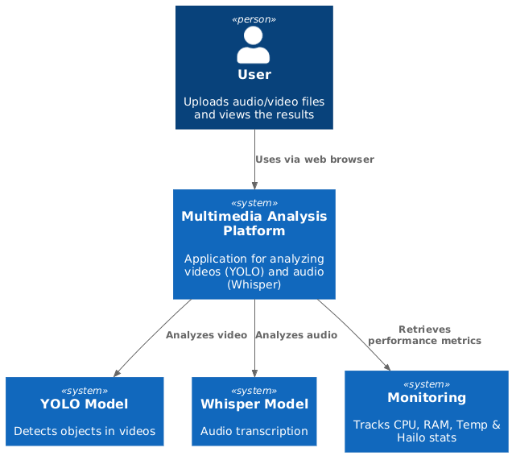
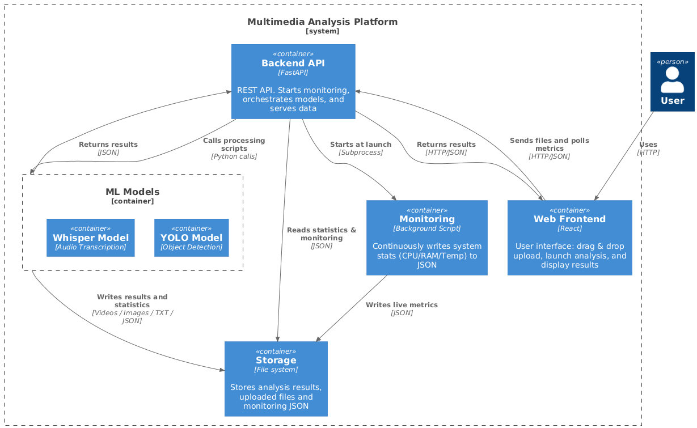

# Industrial Project (2025-2026)

## Project Overview

This project studies different artificial intelligence models for computer vision and Speech-to-Text on audio and video files. The models will be run on a Raspberry Pi 5, allowing performance comparison, with and without the AI accelerator (Hailo AI HAT), and will include a human-machine interface for result visualization.

## Project Goals

The objectives of this project are:

* Use various AI models to detect objects in videos, either in real-time or in imported videos
* Use various AI models to convert audio to text (Speech-to-Text) from video and audio files, either in real-time or from imported files
* Run the models on a Raspberry Pi 5
* Develop a human-machine interface allowing the selection of different test parameters (model used, number of fps, choice of a specific temporal study zone in a video, with or without the accelerator) and videos (real-time camera usage or drag-and-drop video import) and display the results
* Compare the different models used, with and without the Hailo AI HAT accelerator
* Provide a single-command, offline executable application

## Project Architecture

**C4 Diagram Level 1 (System Context):**


**C4 Diagram Level 2 (Container):**


## Project Structure

```text
/
├── README.md                       # Main project README
│
├── interface/
│   ├── README.md
│   ├── frontend/                   # User interface
│   │   ├── src/                    # Frontend source code
│   │   │   ├── api/                # API calls to backend
|   |   |   ├── assets/             # Images, icons, fonts, etc.
|   |   |   ├── components/         # Reusable UI components 
│   │   │   └── pages/              # Full pages (route-level views)
|   |   ├── App.jsx                 # Main React component with routes
│   │   └── index.jsx               # Entry point
|   |
│   └── backend/                    # Backend connecting the interface with the models
|       └── main.py                 # FastAPI app
│
├── models/                         # AI Models (CV and STT)
│   ├── README.md
│   ├── computer_vision/            # Object detection models
│   └── speech_to_text/             # Speech-to-Text models
│
├── monitoring/                     # Monitoring and performance metrics
│   └── README.md
│
├── scripts/                        # Raspeberry Pi installation
│   └── README.md
│
├── tests/                          # Tests and research experiments
│   └── README.md
│
└── docs/                           # Additional documentation, diagrams, notes
```

## Installation Instructions

## Launch
(specify how to launch each component / provide a link to the corresponding README)

To lauch the application:
```
docker-compose up --build
# without --build Docker uses images already built
```

The app is available at:
```
http://localhost:5173/
```

To clean up:
```
docker-compose down -v
docker rmi backend-image:latest frontend-image:latest
```
